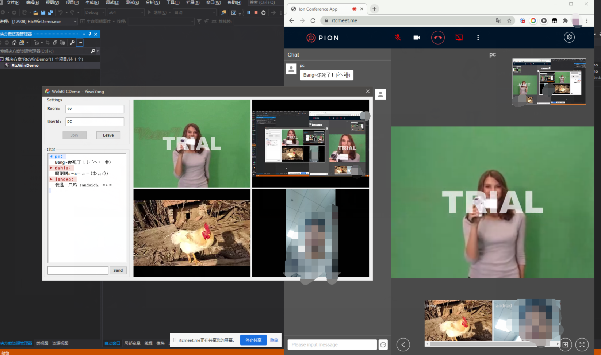

# RtcWinDemo
[SJTU × ByteDance course](https://github.com/sjtu-course/ppt) project. 

By [Yiwei Yang](https://github.com/sjtu-course/homework/tree/main/YiweiYang).

为了方便下载，上传的为加密后的压缩包，密码已通过邮件发送给助教。

## 功能

- [x] **为四路输入都分配了视频窗口，且支持动态加入和离开**
- [x] **添加了发送聊天消息的功能，并优化了显示效果**
- [x] **取消了回车键退出程序的功能，现在回车键可以直接发送聊天框内容**
- [x] **增加了hw1中记录上次登录信息并在下次登录时自动填写的功能**

## 效果图

### 一些细节

- **`HWND CRtcWinDemoDlg::AllocateWindow(bool is_local, std::string track_id)`**
	- demo中这个函数只根据`is_local`判断分配第一个窗口还是第二个窗口，我们修改让其根据类数组成员`remote_window_hwnd_registered[3]`给`track`分配没有被占用的远端窗口。
	- 在`OnInitDialog()`初始化的时候需要重置窗口分配状态`remote_window_hwnd_registered`均为`0`
	- 在`AllocateWindow()`分配远端窗口时需要给对应的数组位置的值置为`1`，表示已被分配。
	- 在`OnBnClickedBtnLeave()`离开房间、`OnDestroy()`结束程序时需要重置窗口分配状态`remote_window_hwnd_registered`均为`0`。
	- 在`RemoveTrack()`移除某个`track`的时候把对应的`remote_window_hwnd_registered`置为`0`.
   
- **`OnBnClickedBtnSend()`**
  - 添加发送聊天消息的功能,发送按钮绑定了`OnBnClickedBtnSend()`，在其中将获取的消息加上发送方的消息打包为`json`。
  - `json`格式为：

		{
			"notification": true,
			"method": "broadcast",
			"data": {
				"info": {
					"msg": "hello",
					"senderName": "pc"
				},
				"rid": "byte",
				"uid": "2556a3dc-32f1-44c5-85b0-4516fa92f8d1"
			}
		}
  - 消息方法为`broadcast`，也会对本地进行推送，所以不需要再专门设置本地聊天框显示自己发送的消息（我之前理解错了）。
  - 需要注意的是按钮发送消息后需要清空输入框。
  - 其中遇到了一个`CString`转`char*`的问题，本来还自己写了转换，后来发现只需要用已经写好的`CStringToStdString()`将`CString`转`string`，再加个`.c_str()`即可。
   
- **记录上次登录信息并在下次登录时自动填写的功能**
  - 增加了[hw1](https://github.com/sjtu-course/homework/tree/main/YiweiYang/hw1/windows)中记录上次登录信息并在下次登录时自动填写的功能，分别是`SaveProfile()`和`LoadProfile()`，在[hw1](https://github.com/sjtu-course/homework/tree/main/YiweiYang/hw1/windows)中我将`CString`转为`LPCWSTR`再去存储有些麻烦，现在我知道了更简单的方法。
   
- **优化了聊天窗的视觉效果**
  - 把CHARFORMAT改成了CHARFORMAT2类型，效果更丰富，更容易区分本地和远程用户。也给聊天窗设置了自动换行，否则遇到特别长的消息看不全。
   
- **取消了回车键退出程序的功能**
  - 之前在聊天窗口条件反射按`Enter`键，结果程序直接结束了。现在回车键可以直接发送聊天框内容，实现方法是重载了从`CDialog`继承过来的`OnOK()`，并将其绑定到`IDOK`事件上。